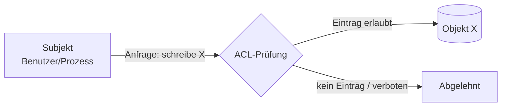

# 🗂️ ACL – Access Control List

Eine **Access Control List** (Zugriffssteuerungsliste) ist eine Liste, die einem **Objekt** (Datei, Topic, Tabelle, Netzwerkport) zugeordnet ist und festlegt, **welches Subjekt** (Benutzer, Gruppe, IP-Adresse, Prozess) **welche Operation** (lesen, schreiben, ausführen, löschen …) ausführen darf.

<!-- TOC -->
## Inhaltsverzeichnis

- [Grundidee](#grundidee)
- [ACL im Dateisystem](#acl-im-dateisystem)
  - [Klassische Unix-Rechte](#klassische-unix-rechte)
  - [POSIX-ACLs](#posix-acls)
  - [Windows (NTFS)](#windows-ntfs)
- [ACL bei MQTT](#acl-bei-mqtt)
- [ACL in Datenbanken](#acl-in-datenbanken)
- [ACL im Netzwerk](#acl-im-netzwerk)
- [ACL in Anwendungen](#acl-in-anwendungen)
- [ACL vs. RBAC vs. ABAC](#acl-vs-rbac-vs-abac)
- [Best Practices](#best-practices)
<!-- /TOC -->

## Grundidee

Jeder ACL-Eintrag (*Access Control Entry*, ACE) beantwortet drei Fragen:

| Wer? (Subjekt) | Worauf? (Objekt) | Was? (Recht) |
| --- | --- | --- |
| Benutzer `openhab` | Topic `lab/beamer/+/set` | schreiben |
| Gruppe `students` | Datei `/srv/lab/data` | lesen |
| Netz `192.168.1.0/24` | Port `2222/tcp` | verbinden |
| Rolle `reporting` | Tabelle `measurements` | `SELECT` |

Die ACL ist damit die **Umsetzung der Autorisierung** (siehe [Authentifizierung & Autorisierung](Authentifizierung%20&%20Autorisierung.md)).



---

## ACL im Dateisystem

### Klassische Unix-Rechte

Linux kennt standardmäßig drei Subjekte (**Besitzer**, **Gruppe**, **Andere**) und drei Rechte (**r**ead, **w**rite, e**x**ecute):

```text
-rw-r----- 1 mosquitto mosquitto 512 Jan 10 12:00 passwd
 │  │  │
 │  │  └── andere:   ---  nichts
 │  └───── Gruppe:   r--  lesen
 └──────── Besitzer: rw-  lesen + schreiben
```

```bash
chmod 640 datei            # rw-r-----
chown mosquitto:mosquitto datei
```

### POSIX-ACLs

Reichen Besitzer/Gruppe/Andere nicht aus, erlauben POSIX-ACLs Rechte für beliebig viele Benutzer und Gruppen:

```bash
setfacl -m u:openhab:r /etc/mosquitto/certs/pi-beamer_ca.crt   # Benutzer openhab darf lesen
setfacl -m g:students:rx /srv/lab                              # Gruppe students darf lesen/betreten
setfacl -d -m g:students:rx /srv/lab                           # Default-ACL für neue Dateien
getfacl /srv/lab
```

Ein `+` am Ende der Rechte in `ls -l` (`drwxr-x---+`) zeigt an, dass eine ACL existiert.

### Windows (NTFS)

Windows arbeitet von Haus aus mit ACLs (Eigenschaften → Sicherheit): Jeder Eintrag erlaubt oder verweigert einem Benutzer/einer Gruppe Rechte wie „Lesen“, „Ändern“, „Vollzugriff“. Ein **Verweigern** hat Vorrang vor einem **Zulassen**.

---

## ACL bei MQTT

Ohne ACL darf jeder authentifizierte Client jedes Topic lesen und schreiben. Mosquitto liest die ACL aus der Datei, die mit `acl_file` angegeben ist:

```text
# Gilt für alle Clients (auch anonyme, falls erlaubt)
topic read $SYS/broker/uptime

user openhab
topic readwrite lab/#

user beamer-ctl
topic read  lab/beamer/+/set
topic write lab/beamer/+/state

# Muster mit Platzhaltern: %u = Benutzername, %c = Client-ID
pattern readwrite users/%u/#
```

Rechte: `read`, `write`, `readwrite`, `deny`. Details: [Best Practices → MQTT](../Best%20Practices/MQTT.md).

---

## ACL in Datenbanken

Datenbanken setzen ACLs über `GRANT` und `REVOKE` um. Moderne Systeme nutzen dafür **Rollen**:

```sql
-- PostgreSQL
CREATE ROLE reporting;
GRANT CONNECT ON DATABASE smarthome TO reporting;
GRANT SELECT ON measurements TO reporting;

CREATE USER grafana WITH PASSWORD '...';
GRANT reporting TO grafana;

REVOKE ALL ON measurements FROM PUBLIC;
```

```sql
-- MariaDB / MySQL
CREATE USER 'grafana'@'192.168.1.%' IDENTIFIED BY '...';
GRANT SELECT ON smarthome.measurements TO 'grafana'@'192.168.1.%';
SHOW GRANTS FOR 'grafana'@'192.168.1.%';
```

Viele Datenbanken bieten zusätzlich **Row-Level Security**: Ein Benutzer sieht nur die Zeilen, die ihm gehören.

---

## ACL im Netzwerk

Router, Switches und Firewalls verwenden ACLs, um Pakete anhand von Quelle, Ziel, Protokoll und Port zu filtern. Die Einträge werden **von oben nach unten** abgearbeitet, die **erste passende Regel** gilt, am Ende steht implizit „alles verbieten“.

```text
! Cisco-Beispiel
access-list 110 permit tcp 192.168.1.0 0.0.0.255 host 192.168.1.20 eq 2222
access-list 110 deny   ip any any
```

Bei `iptables`/`nftables`/`ufw` ist das Prinzip dasselbe, siehe [Whitelist & Blacklist → Firewall](Whitelist%20&%20Blacklist.md#firewall).

---

## ACL in Anwendungen

* **Foren und CMS:** Rechte pro Forum/Kategorie und Benutzergruppe (lesen, schreiben, moderieren)
* **Git-Hosting:** Branch Protection (nur Maintainer dürfen auf `main` pushen)
* **Cloud-Speicher:** Freigaben pro Datei/Ordner und Person
* **Amazon S3:** *Bucket ACLs* und *Bucket Policies*
* **openHAB:** Rollen `administrator` und `user`; die Zugriffssteuerung ist bewusst grob

---

## ACL vs. RBAC vs. ABAC

| Modell | Idee | Beispiel | Geeignet für |
| --- | --- | --- | --- |
| **ACL** | Rechte hängen direkt am Objekt, pro Subjekt | „Datei X: Anna liest, Ben schreibt“ | Wenige Benutzer, wenige Objekte |
| **RBAC** (*Role-Based*) | Rechte hängen an **Rollen**, Benutzer bekommen Rollen | „Rolle *Tutor* darf Abgaben lesen; Anna ist Tutorin“ | Organisationen mit klaren Funktionen |
| **ABAC** (*Attribute-Based*) | Regeln über Attribute von Subjekt, Objekt und Umgebung | „Zugriff, wenn Abteilung = Labor **und** Uhrzeit 7–20 Uhr **und** Gerät verwaltet“ | Komplexe, dynamische Regeln |

In der Praxis wird kombiniert: Eine ACL enthält nicht einzelne Benutzer, sondern **Gruppen/Rollen** – das ist pflegeleichter, weil beim Wechsel eines Hiwis nur die Gruppenmitgliedschaft geändert wird und nicht zwanzig ACLs.

---

## Best Practices

* **Gruppen statt Einzelpersonen** in ACLs eintragen.
* **Least Privilege**: so wenig Rechte wie möglich, so viele wie nötig.
* **Default Deny**: Was nicht in der ACL steht, ist verboten.
* **Regelmäßig überprüfen** (Rezertifizierung): Wer hat welche Rechte noch? Ausgeschiedene Hiwis entfernen.
* **ACLs versionieren** (z. B. Mosquitto-ACL über Ansible-Template aus Git).
* **Testen**: Nach einer Änderung prüfen, dass das Erlaubte geht **und** das Verbotene nicht.

---
