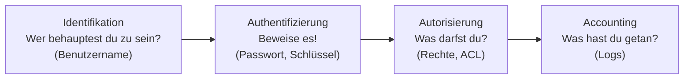

# Zugriffskontrolle

Wer darf was? Diese Frage stellt sich in jedem System – im Betriebssystem, im Forum, in der Datenbank, am MQTT-Broker, an der Firewall, in openHAB. Die Begriffe sind überall dieselben, die Umsetzung unterscheidet sich je nach Domäne.

<!-- TOC -->
## Inhaltsverzeichnis

- [Übersicht](#übersicht)
- [Die drei Grundfragen](#die-drei-grundfragen)
- [Grundprinzipien](#grundprinzipien)
<!-- /TOC -->

## Übersicht

| Dokument | Inhalt |
| --- | --- |
| [Authentifizierung & Autorisierung](Authentifizierung%20&%20Autorisierung.md) | Wer bist du? – Was darfst du? (AAA, MFA, Tokens) |
| [Whitelist & Blacklist](Whitelist%20&%20Blacklist.md) | Erlaubt-/Verbotslisten in Foren, Firewalls, E-Mail, openHAB |
| [ACL](ACL.md) | Access Control Lists in Dateisystem, Datenbank, MQTT, Netzwerk; RBAC und ABAC |

## Die drei Grundfragen

## Grundprinzipien

| Prinzip | Bedeutung |
| --- | --- |
| **Least Privilege** | Jeder bekommt nur die Rechte, die er für seine Aufgabe braucht. |
| **Default Deny** | Was nicht ausdrücklich erlaubt ist, ist verboten (Whitelist-Denken). |
| **Separation of Duties** | Kritische Aktionen erfordern mehrere Personen/Rollen. |
| **Defense in Depth** | Mehrere Schutzschichten: Firewall **und** Passwort **und** ACL **und** TLS. |
| **Need to Know** | Daten sieht nur, wer sie für die Aufgabe braucht. |
